# Indice

- [Deep Learning y Redes Neuronales](#deep-learning-y-redes-neuronales)
- [Funcion de Activacion](#funcion-de-activacion)
  - [Umbral](#umbral)
  - [Sigmoid](#sigmoid)
  - [ReLU (Rectificador Unitario)](#relu--rectificador-unitario-)
  - [Hyper Tangent](#hyper-tangent)
- [Redes Neuronales Artificiales](#redes-neuronales-artificiales)
- [Redes Neuronales Convolucionales](#redes-neuronales-convolucionales)

<small><i><a href='http://ecotrust-canada.github.io/markdown-toc/'>Table of contents generated with markdown-toc</a></i></small>

# Funcion de Activacion

## Threshold

yes or no, no others
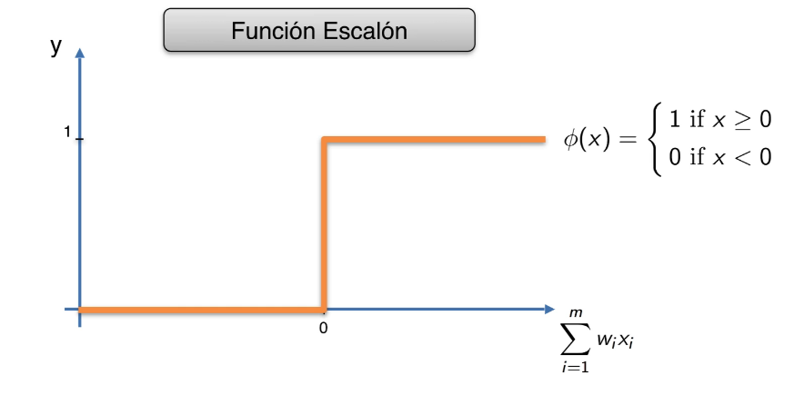

## Sigmoid

Devuelve un porcentaje <br />
is very usefull in the final layer, when you have to precict the final value
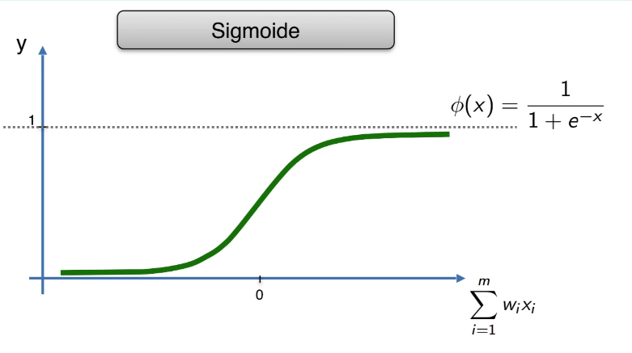

## ReLU (Rectifier)

Transforma todo lo negativo a cero <br />
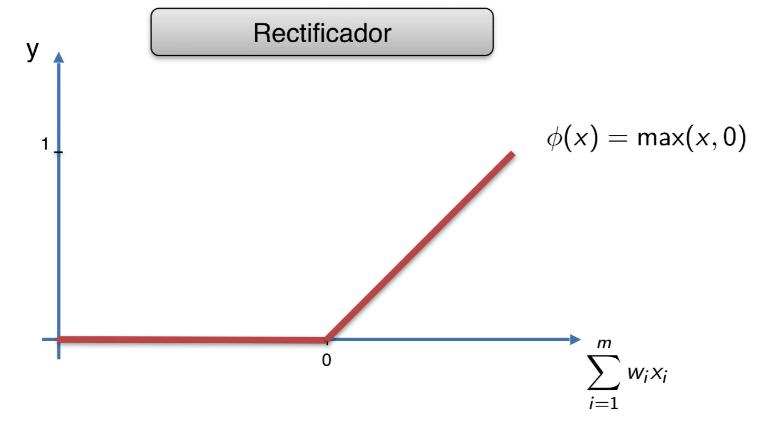

## Hyper Tangent

Tangente HIperbolica <br />
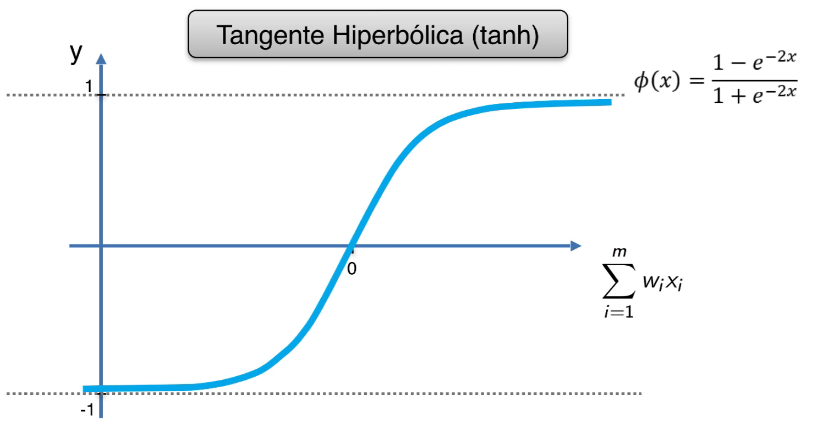

# Redes Neuronales Artificiales

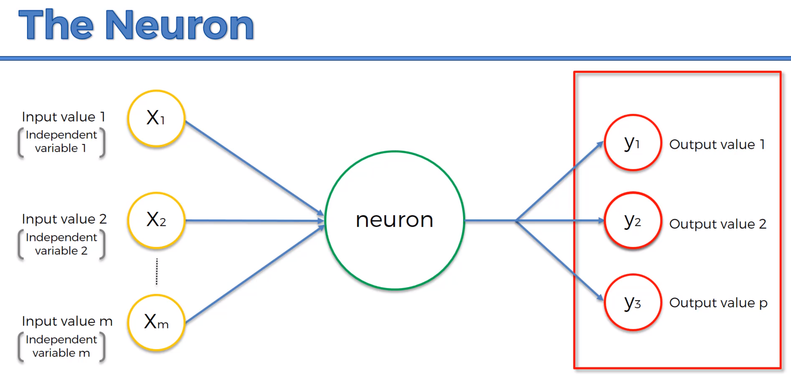<br />
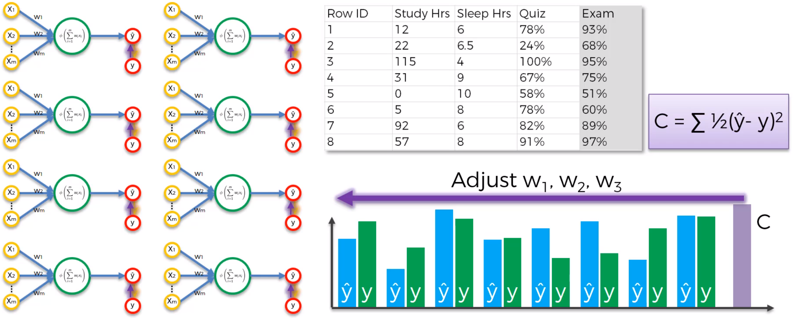<br />
Utilizaremos Relu para que no le de importancia a los valores chicos <br />
Una recomendacion es elegir la media entre la capa entrada y salida para elegir los nodos<br />
El ejemplo es con 11 valores de entraada y 1 de salida

```py
import keras
from keras.models import Sequential
from keras.layers import Dense

classifier = Sequential()

###################
#   Contruccion   #
###################

# input_dim es la dimension de entrada, siempre lo colocamos en la primera capa
# units es el numero de nodos
# kernel_initializer con que distribucion inicializamos los datos
classifier.add(Dense(units = 6, kernel_initializer = "uniform",
                     activation = "relu", input_dim = 11))

# Solo tengo 1 salida, units = 1
# Utilizamos sigmoid para que me devuelva un porcentaje
classifier.add(Dense(units = 1, kernel_initializer = "uniform",  activation = "sigmoid"))

###################
#   Compilacion   #
###################

# optimizer: Conjunto optimo de pesos en la nn (gd, gde, adam)
classifier.compile(optimizer = "adam", loss = "binary_crossentropy", metrics = ["accuracy"])

#####################
#   Entrenamiento   #
#####################

# batch_size: procesar y corregir
classifier.fit(X_train, y_train,  batch_size = 10, epochs = 100)

#####################
#   Prediccion   #
#####################

y_pred  = classifier.predict(X_test)

#####################
#   Evaluacion   #
#####################

from sklearn.metrics import confusion_matrix
cm = confusion_matrix(y_test, y_pred)

from keras.wrappers.scikit_learn import KerasClassifier
from sklearn.model_selection import cross_val_score

# Adaptamos el clasificador para que tome la evaluacion
def build_classifier():
  classifier = Sequential()
  classifier.add(Dense(units = 6, kernel_initializer = "uniform", activation = "relu", input_dim = 11))
  classifier.add(Dense(units = 6, kernel_initializer = "uniform", activation = "relu"))
  classifier.add(Dense(units = 1, kernel_initializer = "uniform", activation = "sigmoid"))
  classifier.compile(optimizer = "adam", loss = "binary_crossentropy", metrics = ["accuracy"])
  return classifier

classifier = KerasClassifier(build_fn = build_classifier, batch_size = 10, nb_epoch = 100)
accuracies = cross_val_score(estimator=classifier, X = X_train, y = y_train, cv = 10, n_jobs=-1, verbose = 1)
mean = accuracies.mean()
variance = accuracies.std()

```

# Recurrent Neural Network

Aprendizaje Supervisado<br />
Se utiliza mucho paara speech, traduccion del lenguaje, para descubrir el contenido de una imagen<br />
Poder entender una secuencia, si digo 'I am a beautiful boy' entender como hacer la traduccion en secuencia (NO PALABRA POR PALABRA), si yo cambio una sola palabra 'I am a bautiful girl', cambian otras palabras en otros idiomas <br />
Podemos devolver una respuesta, o volver otra vez al nodo azul<br />
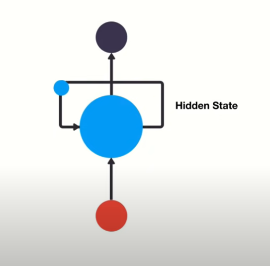<br /><br /><br />
En este caso, en el ultimo step vamos a tener todas las palabras de los anteriores steps<br />
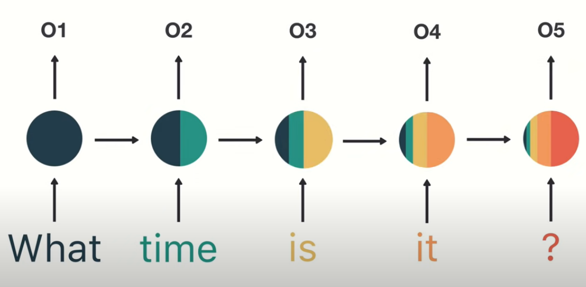<br />

## Ejemplos

Nos puede devolver muchos detalles de una imagen<br />
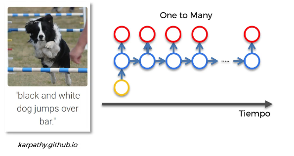<br /><br />

Analisis de sentimientos, en base a un mensaje vemos el sentimiento de la persona<br />
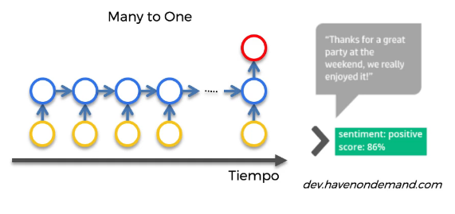<br /><br />

Traduccion, no analiza palabras sueltas, traduccion en conjunto<br />
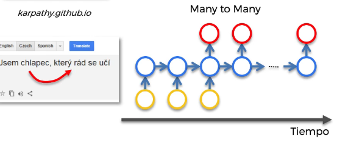<br /><br />

Traduccion, o subtitulos a las peliculas<br />
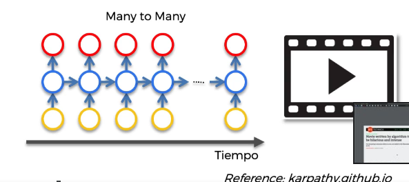<br /><br />

## Vanishing Gradient

Cuando propagamos un error hacia atras tenemos que mandarlo a todas las otras faces<br />
Si vamos multiplicando los valores del gradiante descendente para abajo vamos a seguir teniendo valores mas pequeños, tendiendo a cero, se va desvaneciendo<br />
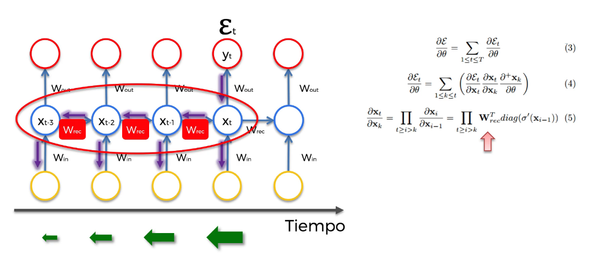<br />

### Soluciones

- Exploding Gradient: propagacion hacia atras que se vaya truncando
- Vashing Gradient: corregir incializacion pesos, redes echo state, **LSTM** (Redes neuronales con corto plazo de memoria)

## LSTM (Long-Short Term Memory)

Memoria a corto plazo, la siguiente imagen es lo que sucede en cada nodo de la capa oculta<br />
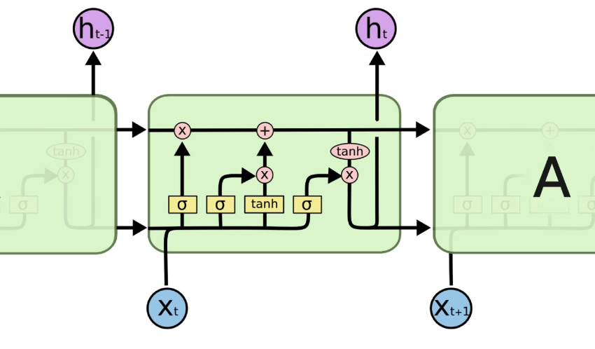<br />
la **C** representa la memoria (fase memoria)<br />
la **h** representa los vaores de entrada y salida de la nn (fase prediccion)<br />
Van a ser todos vectores, por haber aplanado la nn<br />
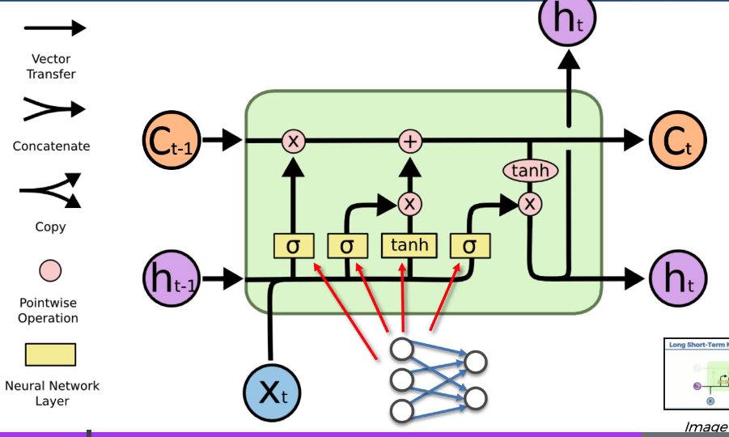<br />
